# Continous Integration Pipeline For Tooling Website
## DevOps Automation
 Automation is the use of technology to perform tasks with reduced human assistance. Automation helps us accelerate processes and scale environments, as well as build continuous integration, continuous delivery, and continuous deployment (CI/CD) workflows. There are many kinds of automation, including IT automation, business automation, robotic process automation, industrial automation, artificial intelligence, machine learning, and deep learning.

Theoretically speaking, We could perform DevOps processes like Continuous Integration, Continuous Delivery and log analytics manually. But doing so would require a large team, a lot of time and a level of communication and coordination between team members that is just not realistic in most situations. 

Automation makes it possible to perform these processes using software tools and preset configurations.

## Benefits of Automation in DevOps
We have seen earlier releases, in the absence of automation taking years to get into the production and also recently with agile, be it lean, scrum or safe, and with a percentage of automation being improved, release timelines are brought down to few months or weeks.But automation is absolutely a must in order to make the releases as fast as possible in a few hours. So, I think it is impossible to make such quick and frequent releases unless we put in automation in place throughout the pipeline.

So, quite obviously then, if we want to achieve the objectives of DevOps, high quality and value delivered to customers via frequent and fast deliveries, Automate everything is a must. Clearly, we know by now that automation removes manual errors, dependency on an individual, performs faster, and achieves accuracy thereby achieving consistency and reliability. Hence, automating everything enables the devops objective of high-quality delivery, enables frequent releases and faster releases.

### In a nutshell, Automation,
* Removes manual errors
* Team members are empowered
* Dependency removed
* Latency removed
* Increases no of deliveries
* Reduces the lead time
* Increases frequency of releases
* Provides faster feedback
* Enables speed, reliability, and consistency.


Acording to Circle CI, Continuous integration (CI) is a software development strategy that increases the speed of development while ensuring the quality of the code that teams deploy. Developers continually commit code in small increments (at least daily, or even several times a day), which is then automatically built and tested before it is merged with the shared repository.

## In this project, We are required to implement CI for Tooling Website using Jenkins.

Below is the updated architecture of our infrastructure. Jenkins will be used for continous integration, and its data will be stored on a remote NFS server.

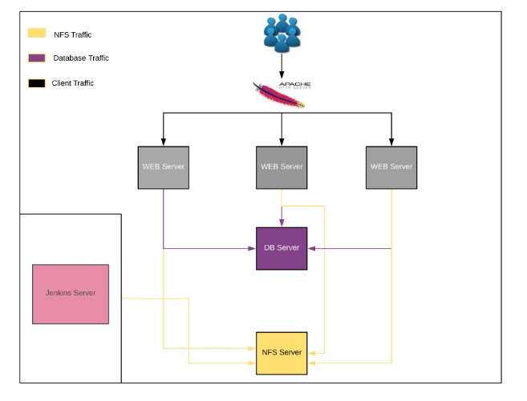

# Steps - Prepare the Jenkins server
* Dedicate a new virtual machine for Jenkins

* Logon to NFS server and ensure the /mnt/opt is exported to allow the Jenkins server make use of the mount.
```
$ sudo showmount -e 172.31.0.10
```
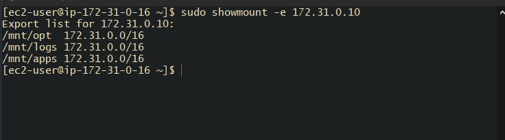

* On our Jenkins Server Mount `/var/lib/` to store data on NFS
```
$ sudo yum install nfs-utils -y
```

```
$ sudo mount -t nfs -o rw,nosuid 172.31.0.10:/mnt/opt /var/lib
```
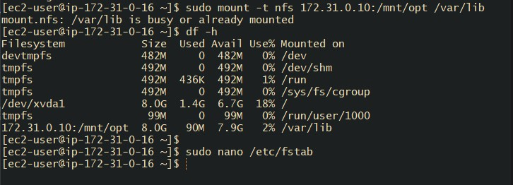

* Download and install jenkins on the Jenkins Server. Also Jenkins requires Java in order to run.
```
$ sudo wget -O /etc/yum.repos.d/jenkins.repo https://pkg.jenkins.io/redhat-stable/jenkins.repo

$ sudo rpm --import https://pkg.jenkins.io/redhat-stable/jenkins.io.key
```

* Then install Jenkins
```
$ sudo yum install jenkins -y

$ sudo yum install java-1.8.0-openjdk -y
```

```
$ sudo systemctl daemon-reload
```


## Start Jenkins
* We can enable the Jenkins service ar boot time with the command:
```
$ sudo systemctl enable jenkins
```

* We can start the Jenkins service with the command:
```
$ sudo systemctl start jenkins
```

* We can check the status of the Jenkins service using the command:
```
$ sudo systemctl status jenkins
```
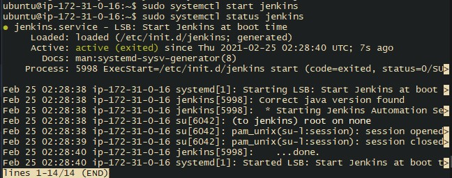


### Set Jenkins to listen on port 8080. Access this port with your browser to start configuration

* Login to our brower to configure the Jenkins server
```
http://public-ip-address-jenkins-server:8080
```
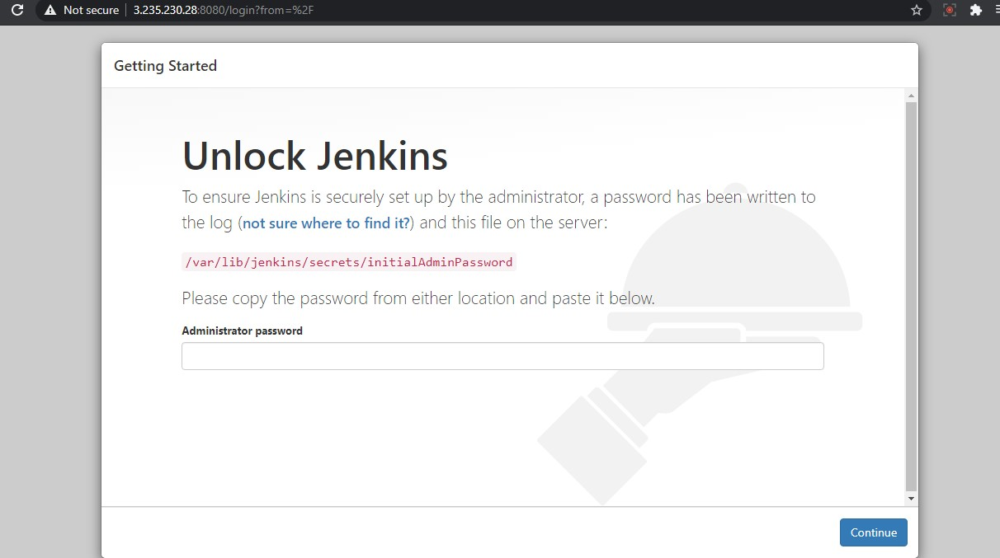

* We need to get a password has been written to the log */var/lib/jenkins/secrets/initialAdminPassword* To ensure Jenkins is securely set up by the administrator.
```
$ sudo cat /var/lib/jenkins/secrets/initialAdminPassword
```
* We need to install the suggested plugins to make or Jenkins work effectively

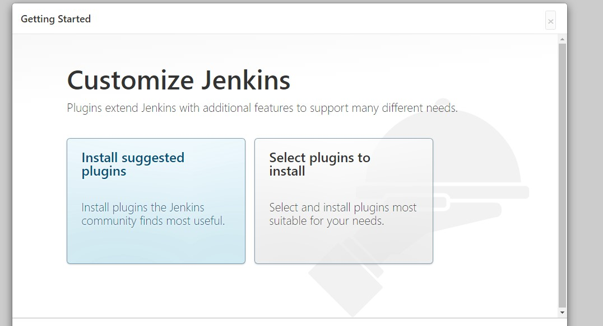

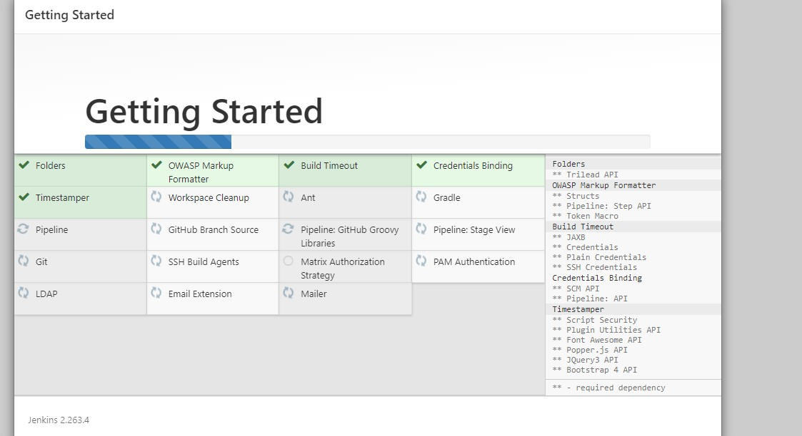

* Create Admin user and passowrd for login.

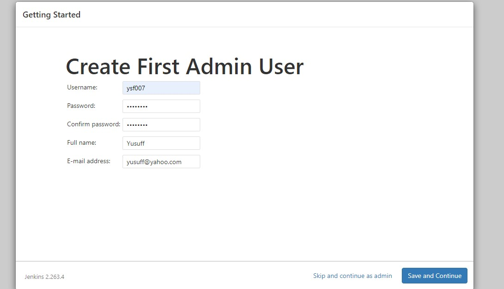

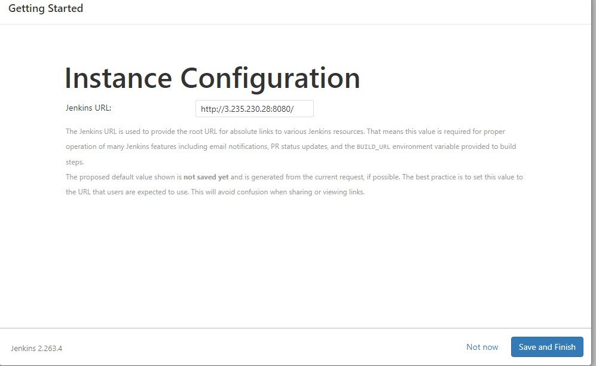


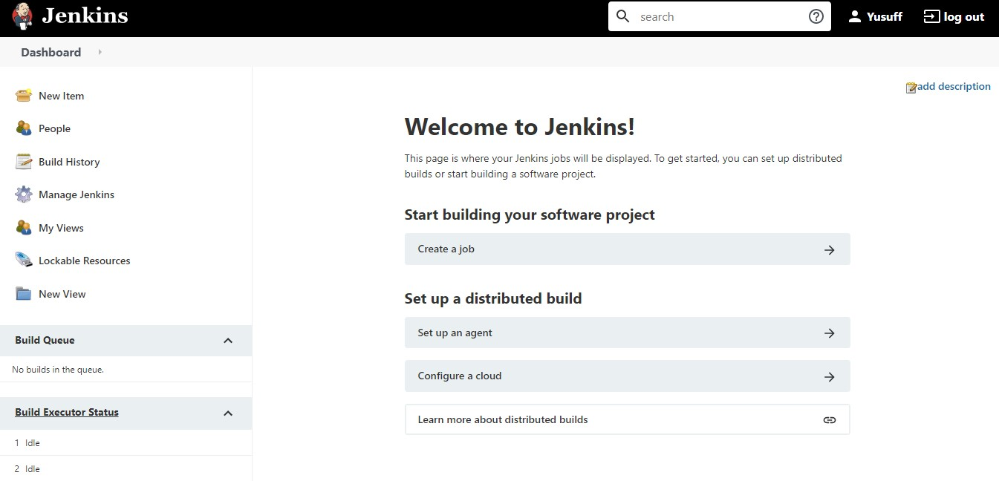


### Configure a simple jenkins job to automatically build the tooling website code periodically every 2 mins

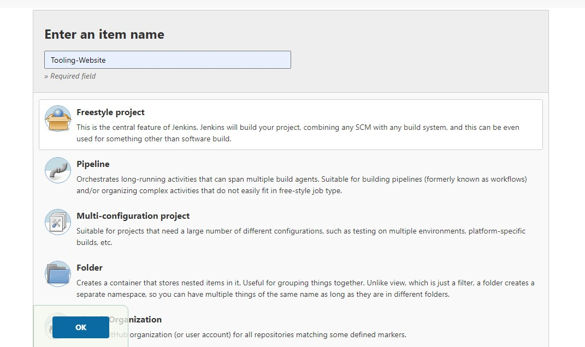

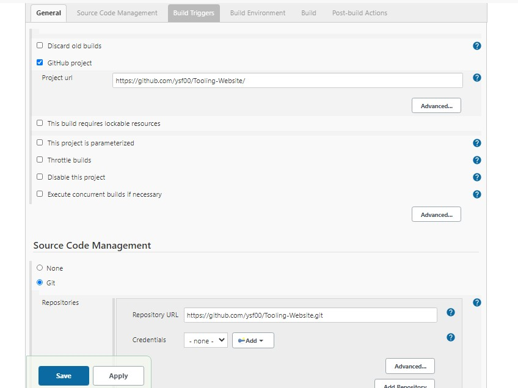

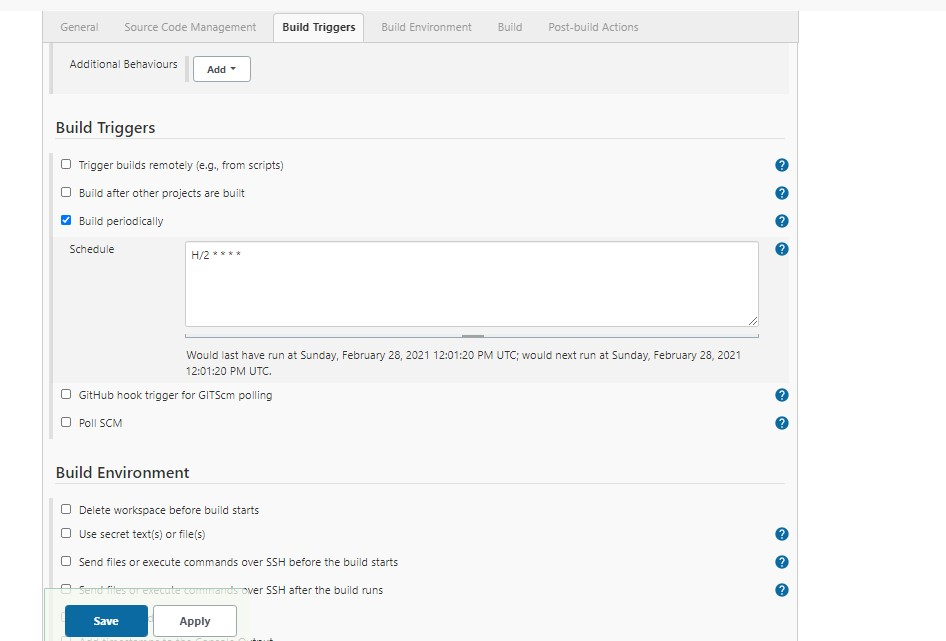

### Simulate a code change and see how every code push is being deployed to each of the web servers.

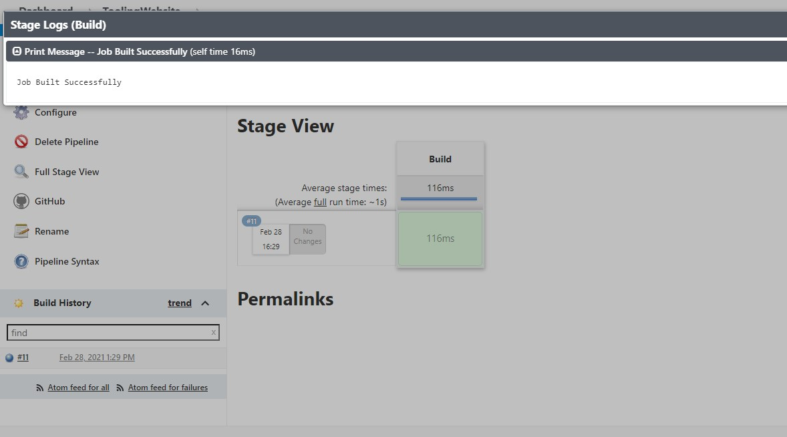

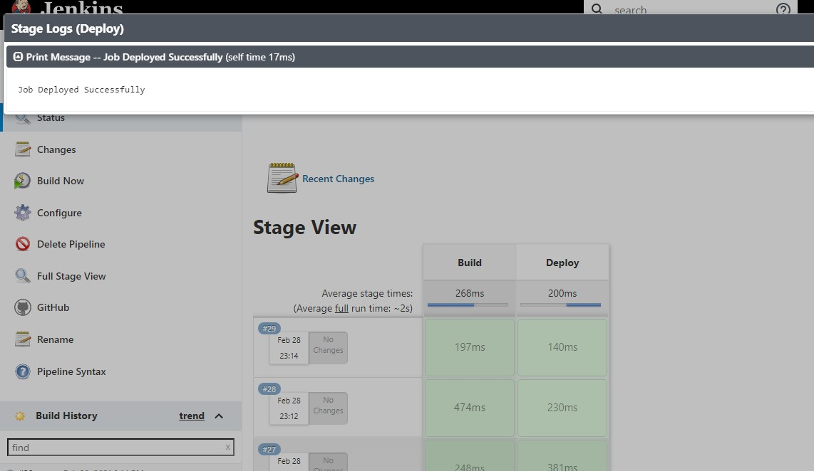

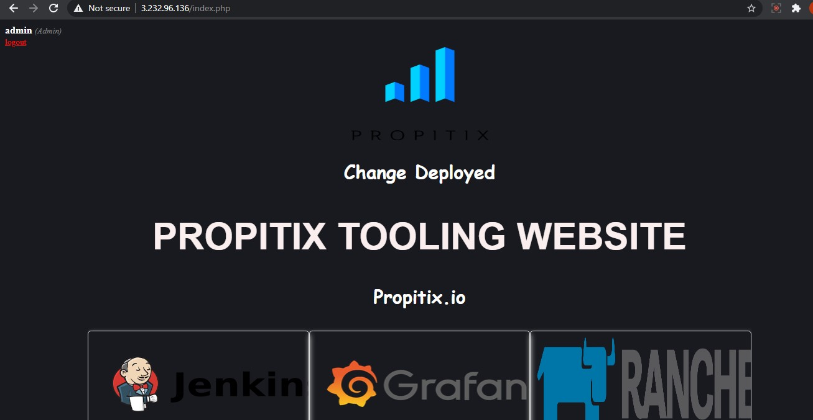

# Credits
[DevOps Career And Mentorship Experts](https://darey.io)